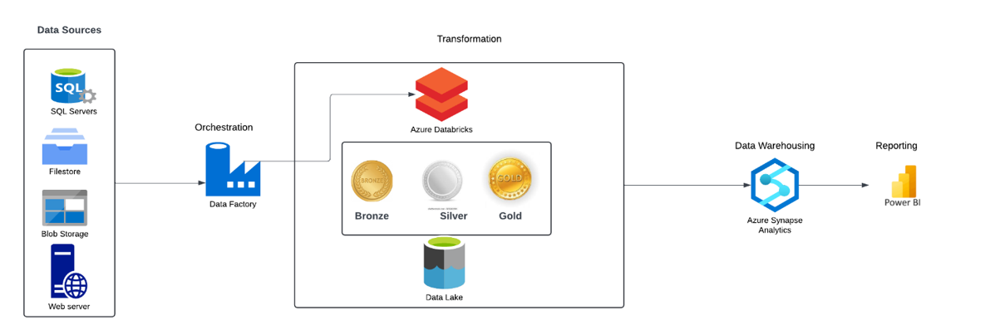

# Corporación Favorita Grocery Sales Data Pipeline  
**End-to-End Data Engineering Project with Azure**  

**Overview:**
   An end-to-end data pipeline leveraging Azure Data Lake Storage (ADLS Gen2), Azure Databricks (PySpark), and Azure Data Factory (ADF) to ingest, transform, and analyze grocery sales data, with a Power BI 
   dashboard for actionable business insights.

## 🛠️ **Tools & Technologies**  
| **Stage**         | **Tools**                                  |
|--------------------|--------------------------------------------|
| **Data Ingestion** | Azure Data Lake Storage (ADLS) Gen2        |
| **Transformation** | PySpark (Azure Databricks)                 |
| **Orchestration**  | Azure Data Factory (ADF)                   |
| **Analysis**       | Synapse                                    |


**Azure Architecture Diagram**



## 📂 **Pipeline Architecture**  


1. **Ingestion**:  
   - Raw CSV files (sales, stores, items) stored in ADLS Gen2.  
2. **Transformation**:  
   - PySpark code in Databricks cleans and aggregates data (e.g., filtering nulls, joining tables).  
3. **Orchestration**:  
   - ADF pipelines automate data movement from ADLS to Databricks.  
4. **Analysis**:  
   - Mock Power BI dashboard created locally due to Azure account restrictions.  

💡 **Tip**: Replace `adf_pipeline.png` with your actual screenshot filename. Add a 1-2 line description for each stage.

---

## 🔍 **Key Screenshots & Code Snippets**  

### 1. **ADLS Gen2 Configuration**  
  
*Raw and transformed data folders in Azure Data Lake Storage.*  

### 2. **PySpark Transformation Code**  
```python  
# Load raw transactions data from ADLS Gen2 (example)
transactions_df = spark.read.csv("adls://raw/transactions.csv")

# Clean data: Remove nulls and filter valid sales
clean_df = transactions_df.dropna().filter("sales_amount > 0")

# Write transformed data to ADLS Gen2 in Parquet format
clean_df.write.parquet("adls://transformed/clean_transactions.parquet")
