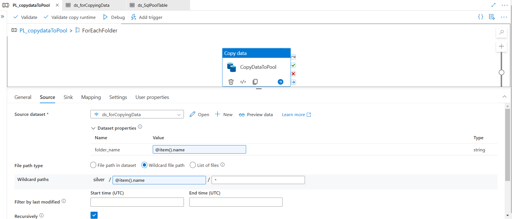
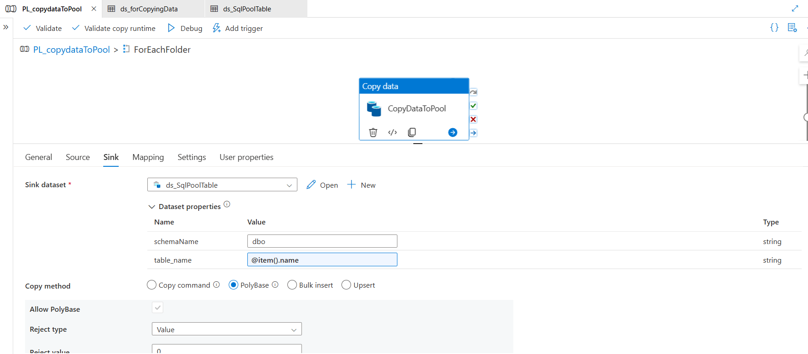

# Corporación Favorita Grocery Sales Data Pipeline  
**End-to-End Data Engineering Project with Azure**  

 ## 🚀 Overview  

This project showcases an **end-to-end data engineering pipeline** using **Azure services**, designed to efficiently **ingest, transform, and store** grocery sales data for analytics and reporting. The pipeline follows a **structured, metadata-driven approach** for automation and scalability.  

### 🔹 **Key Components of the Pipeline**  

✔ **Azure Data Lake Storage Gen2 (ADLS Gen2)** → Centralized storage for raw and processed data.  
✔ **Azure Data Factory (ADF)** → Automates data ingestion from multiple sources into ADLS Gen2.  
✔ **Azure Databricks (PySpark)** → Cleanses, transforms, and enriches data using distributed computing.  
✔ **Azure Synapse Pipelines** → Loads transformed data into **Synapse Dedicated SQL Pool** for warehousing.  

The final processed data is stored in **Synapse SQL Pool**, making it ready for **further analysis and business intelligence applications**. This solution is **scalable, fully automated, and optimized for large datasets**. 🚀  

## 🛠️ **Tools & Technologies**  
| **Stage**         | **Tools**                                  |
|--------------------|--------------------------------------------|
| **Data Ingestion** | Azure Data Lake Storage (ADLS) Gen2        |
| **Transformation** | PySpark (Azure Databricks)                 |
| **Orchestration**  | Azure Data Factory (ADF)                   |
| **Warehousing**    | Azure Synapse                              |

**Azure Architecture Diagram**

## 📊 Dataset Source  
The raw dataset used in this project is available here:  

📂 [**Raw Data Files**](data/raw_data)  

🔹 Above folder contains the original CSV files sourced from [Kaggle](https://www.kaggle.com/datasets/ruiyuanfan/corporacin-favorita-grocery-sales-forecasting).  
🔹 These files include **sales transactions, store information, item details, holiday events, and oil price data**.  
🔹 You can download them directly from this repository without needing a Kaggle account.  

## 🚀 Data Ingestion Process

To ensure a **fully automated and dynamic data ingestion pipeline**, this project leverages **Azure Data Factory (ADF), Azure SQL Database, and Azure Data Lake Storage Gen2 (ADLS Gen2)**. The ingestion pipeline is designed to handle **multiple data sources dynamically** using **parameters**, making it flexible and scalable.

### 🔹 Pipeline Design

1️⃣ **Metadata-Driven Ingestion**  
   - The paths for all **data sources** are stored in an **Azure SQL Database** table.
   - This table contains a **Path column**, which holds the source location of each dataset.
   - The ingestion process dynamically retrieves these paths and processes the data accordingly.

2️⃣ **Lookup & Iteration**  
   - The pipeline starts with a **Lookup Activity (metaDataLookup)** that retrieves the source paths from Azure SQL Database.  
   - A **ForEach Activity (ForEachFile)** iterates through each retrieved path.

3️⃣ **Dynamic Source Selection**  
   - Inside the `ForEach` loop, a **Switch Activity (SwitchSourceType)** dynamically selects the appropriate source type.  
   - This allows the pipeline to handle **multiple source types without hardcoding paths**.

4️⃣ **Data Movement & Storage**  
   - Based on the source type, the **Copy Activity** moves the data to **Azure Data Lake Storage Gen2 (ADLS Gen2)**.  
   - The pipeline supports **multiple data sources**, including:  
     ✔ **Azure File Share**  
     ✔ **Azure Blob Storage**  
     ✔ **On-Premises SQL Server**  

### ✅ Key Benefits of This Approach  
✔ **Automated & Scalable** → No manual intervention needed; new sources can be added dynamically.  
✔ **Metadata-Driven** → Azure SQL Database controls the ingestion process.  
✔ **Multi-Source Support** → Handles data from different sources seamlessly.  
✔ **Optimized for Cloud Storage** → Stores all ingested data in **ADLS Gen2** for further processing.  

This **ingestion pipeline** serves as the **foundation** for the data engineering workflow, ensuring a **robust, scalable, and flexible** solution for managing diverse data sources. 🚀
(Note: All the images are provided in the **screenshots** folder.)

## 🚀 Data Transformation Process

Once the raw data is ingested into **Azure Data Lake Storage Gen2 (ADLS Gen2)**, the transformation process is executed in **Azure Databricks** using **PySpark**. This ensures the data is **cleaned, enriched, and structured** for efficient querying and analysis.

### 🔹 Key Transformation Steps

1️⃣ **Reading Data Dynamically**
   - The transformation process dynamically **reads data** from ADLS Gen2 based on **file name parameters**.
   - The storage account and container names are securely retrieved using **Azure Key Vault** secrets.

2️⃣ **Handling Missing Values**
   - Missing values in any column are replaced with `0` to maintain **data integrity**.

3️⃣ **Removing Duplicates**
   - The pipeline identifies **duplicate rows** across all columns and removes them.
   - The data is then sorted by **date** and **store number** to ensure proper sequencing.

4️⃣ **Feature Engineering & Standardization**
   - **Item Data**:
     - Converts **"perishable"** column to **Yes/No** values.
     - Standardizes **"family"** column by converting text to lowercase.
   - **Holiday Events Data**:
     - Standardizes the **"type"** column to lowercase.
     - Adds new columns:  
       ✔ **"transferred_holiday"** (Yes/No)  
       ✔ **"day_of_week"** (Extracted from date)  
       ✔ **"is_weekend"** (Yes/No based on day)  
   - **Oil Prices Data**:
     - Renames **"dcoilwtico"** to **"daily_wti_oil_price"** for better clarity.
   - **Store Data**:
     - Standardizes **"city"** and **"state"** to lowercase.
     - Creates a **new store category** based on the store type (Large, Medium, Small, Specialty).
   - **Transactions Data**:
     - Extracts **day of the week** from transaction dates.

5️⃣ **Writing Transformed Data**
   - The final transformed datasets are written to **ADLS Gen2 Silver Layer** in **Parquet format** for optimized performance.

## 🔗 Full PySpark Code  
📂 You can view the **full transformation script** here:  
👉 [View Full PySpark Code](https://github.com/SavanKumarChauhan/Grocery-Sales-Pipeline/blob/main/transformation/grocery_transformation.py)

## 🚀 Data Orchestration Process

To automate the movement of data from **Azure Data Lake Storage Gen2 (ADLS Gen2) to Databricks**, the project leverages **Azure Data Factory (ADF) pipelines** for orchestration. This ensures a seamless, **metadata-driven, and scalable** data transformation workflow.

### 📸 Pipeline Workflow  

   **ADF Orchestration Pipeline diagram** 
🔗 

### 🔹 Key Components of the Orchestration Pipeline  

The pipeline consists of multiple steps to **ingest, transform, and move data** dynamically:

1️⃣ **Execute Data Ingestion Pipeline**  
   - The **transformation pipeline** starts by executing the **PL_IngestData pipeline**, which ensures that raw data is available in **ADLS Gen2 (Bronze layer)** before processing.

2️⃣ **Retrieve Metadata from ADLS (Bronze Layer)**  
   - The pipeline **fetches metadata** from the ingested files stored in **ADLS Gen2 (Bronze layer)**.  
   - This metadata contains information about the **file names, locations, and schema**, which is then used to drive the transformation process.

3️⃣ **Iterate Through Files Dynamically**  
   - A **ForEach Activity (ForEachFileName)** loops through the list of files retrieved from the metadata.  
   - Each file is processed dynamically based on its type, allowing the pipeline to handle **multiple datasets efficiently**.

4️⃣ **Trigger PySpark Transformation in Databricks**  
   - Inside the **ForEach loop**, a **Databricks notebook** (`Grocery_transformation`) is triggered to perform **data cleaning, deduplication, and feature engineering**.  
   - The pipeline ensures that **each dataset undergoes the appropriate transformations** based on predefined business rules.

5️⃣ **Load Transformed Data into ADLS Gen2 (Silver Layer)**  
   - The transformed data is **stored in ADLS Gen2 (Silver Layer)** in **Parquet format** for optimized querying.  
   - This Silver Layer serves as the foundation for downstream analytics in **Azure Synapse and Power BI**.

---

### ✅ Key Benefits of This Orchestration Approach  

✔ **Automated Execution** → No manual intervention is needed. The pipeline triggers automatically.  
✔ **Scalable & Dynamic** → Handles multiple files without hardcoding file paths.  
✔ **Metadata-Driven Processing** → Uses metadata to control the pipeline flow dynamically.  
✔ **Seamless Integration** → Connects **ADF, ADLS, and Databricks** for efficient data movement.  

🚀 **This orchestration pipeline ensures a robust data engineering workflow, enabling large-scale analytics with minimal operational overhead.**  

## 🚀 Data Warehousing with Azure Synapse Analytics  

To enable **efficient querying and reporting**, the transformed data from **Azure Data Lake Storage (Silver Layer)** is loaded into **Azure Synapse Analytics** using **Synapse Pipelines**. This step ensures data is structured and optimized for analytics.  

---

### 🔹 Data Loading Process  

1️⃣ **Source: ADLS Gen2 (Silver Layer)**  
   - The cleaned data is stored in **Parquet format** in ADLS Gen2.  
   - The file paths and table mappings are **parameterized** for dynamic ingestion.  

2️⃣ **Data Ingestion using Synapse Pipelines**  
   - A **Synapse Pipeline (`PL_copydataToPool`)** moves data from ADLS Gen2 into **Synapse Dedicated SQL Pool**.  
   - The **ForEach loop** dynamically processes multiple datasets.  

3️⃣ **Optimized Loading with PolyBase**  
   - The **Copy Data activity** reads **Parquet files** and maps them to **Synapse SQL tables**.  
   - **PolyBase** is used for efficient **bulk loading** into the warehouse.  

4️⃣ **Final Storage in Synapse SQL Pool**  
   - The transformed data is stored in **structured tables**, ready for querying via **T-SQL, Synapse Studio, and Power BI**.  

---

### 📸 Pipeline Workflow  

---

### ✅ **Final Project Summary**  

✔ **End-to-End Data Engineering** → From ingestion to analytics using **Azure Data Platform**.  
✔ **Scalable & Automated Pipelines** → Dynamic data movement with **Databricks & Synapse Pipelines**.  
✔ **Optimized for BI & Reporting** → Data stored in **Synapse SQL Pool**, ready for **Power BI dashboards**.  

🚀 **This data pipeline provides a robust foundation for enterprise analytics, supporting scalable and real-time insights.**  

---

